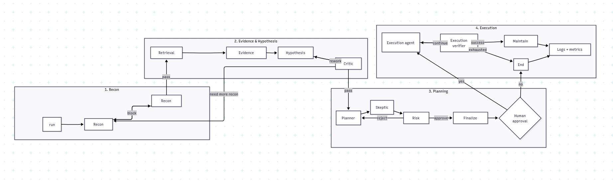

# Architecture



| **Agent** | **Responsibility** |
| --- | --- |
| **Recon Agent** | Runs `nmap`, `curl`, `nc` etc. via `run_shell` tool. Incrementally parses output into WorldState. Loops until `done=true` or max steps. |
| **Recon Verifier** | Programmatic check: needs ≥1 service with confidence ≥0.5 + version identified. Optional LLM consistency check for banner mismatches. Can send recon back if insufficient. |
| **Hypothesis Agent** | For each discovered service: searches CVEs → fetches details → checks version range compatibility → extracts prerequisites via LLM → verifies prerequisites against WorldState → computes confidence score (40% service confidence + 30% version match + 20% exploit availability + 10% prerequisites met). |
| **Hypothesis Verifier**  | Blocks hypotheses with evidence_chain < 2 or confidence < 0.3. Forces forward if stuck. |
| **Planner** | Uses `PLANNING_TOOLS` (search_cve, get_cve_detail, search_exploitdb, search_github) to propose exploit plans. Outputs `current_proposal` into state. |
| **Skeptic** | Receives planner's proposal + **failed attempts summary** from episodic/decision memory. Flags any CVE that was previously tried and failed as a "rabbit hole." |
| **Risk Officer** | Issues APPROVE or REJECT verdict. Auto-approves after 2 debate rounds to prevent infinite loops. |
| **Finalize Planning** | Parallel exploit searches (GitHub + ExploitDB) for all candidate CVEs. Runs CVE scoring pipeline. Updates `execution_readiness` for hypotheses with confirmed exploit code. |
| **Execution Agent** | LLM-driven exploit execution. Loops: LLM call → `run_shell` → episodic log → verifier. Tracks invalid commands, token usage, step count. |
| **Execution Verifier** | Scans recent output for success markers (`uid=0`, `flag{`, `Meterpreter session`, `$ prompt`). Returns `continue`, `success` (→ maintain_access), or `exhausted` (→ END). |
| **Maintain Access** | Passive session verification. Runs `id`, `whoami`, `hostname` probes. Detects privilege level (`root` vs `www-data`). Updates WorldState.sessions. |

## **The 3-Layer Memory System:**

**WorldState:**

 A typed graph of everything discovered about the target system.

```
WorldState
  └── hosts: dict[ip → HostInfo]
        ├── ip: "10.0.0.1"
        ├── os_hint: "Linux"
        ├── os_confidence: 0.4
        └── services: list[ServiceInfo]
              ├── port: 80
              ├── name: "apache"
              ├── version: "2.4.49"
              ├── banner: "Apache/2.4.49 (Ubuntu)"
              ├── accessibility: "open"
              ├── confidence: 0.55          ← how sure are we?
              ├── evidence: ["nmap -sV ..."] ← raw proof
              └── cpe: "cpe:2.3:a:apache..."
  
  ├── credentials: list[Credential]         ← found/guessed creds
  └── sessions: list[Session]               ← established footholds 
```

→ Giảm mất context giữa recon → hypothesis → exploit; tránh chọn CVE sai vì quên version/port/session

**EpisodicMemory** 

 An append-only log of every tool call, LLM inference, and verifier check.

```
Episode(
    step=7,
    timestamp=1700000000.0,
    phase="recon",
    action_type="tool_call",
    command="nmap -sV -p 80 10.0.0.1",
    args={"command": "...", "mode": "recon"},
    output_summary="PORT   STATE SERVICE VERSION\n80/tcp open  http    Apache 2.4.49",
    outcome="success",
    tokens_used=0,
    was_repeat=False,
    error_message="",
)
```

Every time an episode is logged, it checks if the exact same command+args was seen before. If yes → was_repeat = True. This is the foundation for stuck-agent detection.

→ Giảm repeated action, deadlock, lặp scan, thử lại exploit đã fail

**DecisionMemory**

Every significant decision made during the pentest, with the reasoning behind it and the eventual outcome.

```
Decision(
    step=15,
    phase="hypothesis",
    question="Which vulnerabilities to investigate?",
    chosen="CVE-2021-41773",
    alternatives=["CVE-2021-42013", "CVE-2021-41774"],
    reasoning="Selected CVE-2021-41773 from retrieval shortlist (score=0.790, readiness=0.711, source=github)",
    evidence_refs=[12, 13, 14],← episodic step indices that support this decision
    confidence=0.790,
    outcome="validated",       ← set later by verifier/execution
)
```

→ Giảm hallucination trong chọn exploit, giúp debug quyết định sai, giải thích được vì sao agent đi hướng đó

### **So sánh:**

|  | PentestGPT | Current architecture |
| --- | --- | --- |
| WorldState | Pentesting Task Tree bằng natural language | World-state graph có cấu trúc: host/service/version/credential/session |
| EpisodicMemory  | Parsing/summarization output | Episodic log đầy đủ command-output-error-result |
| DecisionMemory | Có reasoning task tree nhưng chưa tách riêng “vì sao chọn A bỏ B” | Decision memory lưu rationale, rejected candidates, failed attempts |
| Mức tự động | Vẫn cần human executor/feedback | Có Recon Agent, Verifier, Hypothesis Agent, Planner, Skeptic, Risk Officer, Execution Agent |

|  | HackSynth | Current architecture |
| --- | --- | --- |
| State thật của target | Nằm trong summary | World-state graph riêng |
| Log thao tác | Summarizer nén lại | Episodic memory giữ log chi tiết |
| Lý do chọn exploit | Không phải thành phần chính | Decision memory riêng |
| Kiểm chứng | Chủ yếu dựa planner/summarizer loop | Recon Verifier, Hypothesis Verifier, Execution Verifier, Skeptic, Risk Officer |

|  | VulnBot | Current architecture |
| --- | --- | --- |
| Task structure | PTG: task, dependency, command, result, status | Pipeline + state graph + hypothesis shortlist + debate |
| Inter-agent memory | Summarizer truyền key outcomes | World-state + episodic + decision memory tách riêng |
| Error handling | Check & Reflection mechanism | Verifier/Critic/Skeptic/Risk Officer ở nhiều điểm |
| Past knowledge | Memory Retriever dùng vector DB/RAG | Retrieval + evidence normalizer + decision trace |

|  | PentestAgent | Current architecture |
| --- | --- | --- |
| Environmental memory | Có DB thông tin môi trường | World-state graph chi tiết hơn: host-service-version-credential-session |
| Execution history | Có DB lịch sử exploit/execution | Episodic memory dùng trực tiếp cho verifier, skeptic, repeated-action detection |
| Knowledge retrieval | Search Agent + RAG attack knowledge | Retrieval Agent + Evidence Normalizer + Hypothesis Agent |
| Decision quality | Planning dựa RAG và exploit knowledge | Decision memory lưu vì sao chọn/reject, Skeptic phản biện proposal |
| Validation/debugging | Có validation/debugging capability | Thêm nhiều cổng kiểm chứng: Recon Verifier, Hypothesis Verifier, Execution Verifier, Risk Officer |

## **Recon Verifier:**

Verifier check:

| Requirement | Threshold |
| --- | --- |
| Service confidence | At least one service with confidence ≥ 0.5 |
| Version detection | At least one service must have a version string |

Check last 3 recon actions: repeated → force forward

LLM Check:

1. CONSISTENCY: Do service findings contradict each other?
2. CONFIDENCE: Are service identifications reliable enough?
3. VERDICT: Is reconnaissance sufficient to proceed?

→ return  "consistency": "ok|conflict”

Confidence:

Source 1: nmap

| **Scenario** | **Confidence** | **Why** |
| --- | --- | --- |
| nmap found port + service name + version number | 0.55 | Version extraction is strong evidence |
| nmap found port + service name only (no version) | 0.40 | Below threshold — needs deeper probing |

Source 2:

| **Scenario** | **Confidence** |
| --- | --- |
| LLM identified service with version | 0.60 |
| LLM identified service without version | 0.40 |

## **Hypothesis Agent**

```
retrieval_agent → evidence_normalizer → hypothesis_agent → critic_agent
                                                         │
                                    rework_hypothesis ←──┘(loop back,max 1 round)
                                    need_more_recon ────→ back to recon phase
                                    pass/best_effort ───→ forward to planning
```

**Node 1: Retrieval Agent** 

Takes the WorldState from recon and runs a 5-stage pipeline:

| Stage | What It Does |
| --- | --- |
| Fingerprint | Converts WorldState services into `ProductFingerprint` objects — normalized product name, vendor, version, CPE candidates, platform hints |
| CPE Update | Enriches WorldState with CPE data from fingerprints |
| Authoritative Records | Queries `cvemap`/NVD for official CVE records matching each fingerprint's product+version |
| PoC Candidates | Searches ExploitDB, GitHub, and Google for exploit code linked to each CVE |
| Procedure Extraction | Parses exploit repos to extract commands, dependencies, setup steps, success indicators |

**Node 2: Evidence Normalizer** 

cross-references all evidence and scores each candidat

| Check | Returns | Weight |
| --- | --- | --- |
| Version Match | `"yes"` / `"no"` / `"unknown"` | 35% |
| CPE Match | `"yes"` / `"no"` / `"unknown"` | 25% |
| Platform Match | `"yes"` / `"no"` / `"unknown"` | 15% |
| Auth Match | `"yes"` / `"no"` / `"unknown"` | 10% |
| Network Match | `"yes"` / `"no"` / `"unknown"` | 15% |

{"yes": 1.0, "unknown": 0.5, "no": 0.0}

The Full Confidence Score Formula

```

applicability = (
version_match_num  * 0.35 +    # 35% — does target version fall in vulnerable range?
cpe_match_num      * 0.25 +    # 25% — does CPE/product name match CVE description?
platform_match_num * 0.15 +    # 15% — does OS/platform match?
auth_match_num     * 0.10 +    # 10% — if auth required, do we have credentials?
network_match_num  * 0.15      # 15% — is the port actually open?
)
readiness = 1.0 if procedure_ready else 0.35   # exploit code has commands/steps?
score = (
applicability      * 0.40 +    # 40% — how well does this CVE match the target?
trust_score        * 0.25 +    # 25% — how trustworthy is the source?
readiness          * 0.20 +    # 20% — is the exploit ready to run?
raw_confidence     * 0.10 +    # 10% — PoC candidate's own confidence
- (estimated_cost / 5.0) * 0.05  # -5% penalty for complexity
)
```

Trust Scores by Source

```
_TRUST = {
"vendor":    1.0,    # Vendor advisory — highest trust
"kev":       0.95,   # CISA Known Exploited Vulnerabilities
"nvd":       0.85,   # National Vulnerability Database
"cvemap":    0.85,   # ProjectDiscovery CVEMAP
"exploitdb": 0.80,   # ExploitDB
"github":    0.65,   # GitHub PoC repos
"google":    0.35,   # Google search results — lowest trust
}
```

Verdict Classification:

| Score | Condition | Verdict |
| --- | --- | --- |
| Any `"no"` in version/cpe/platform/network | `hard_mismatch` | `"reject"` |
| `≥ 0.72` AND `version_match == "yes"` | `strong evidence` | `"strong"` |
| `≥ 0.50` | `moderate evidence` | `"weak"` |
| `< 0.50` | `insufficient` | `"reject"` |

**Node 3: Hypothesis Agent**

takes the shortlist (best CVE/exploit candidates) and converts it into structured `VulnHypothesis` objects.

```
VulnHypothesis(
    service="apache",
    version="2.4.49",
    port=80,
    cve_id="CVE-2021-41773",
    confidence = float(shortlist_item["score"]),       # from assessment.score
    execution_readiness = score * (0.9 if procedure_ready else 0.6),
    evidence_chain = [fingerprint evidence + record evidence + candidate evidence + procedure commands],
    prerequisites_status = {
        "version_match": "yes",
        "cpe_match": "yes",
        "platform_match": "yes",
        "auth_match": "yes",
        "network_match": "yes",
    },
    assessment_verdict = "strong",
)
```

**Node 4: Critic Agent**

| Condition | Verdict |
| --- | --- |
| shortlist exists | `"best_effort_pass"` |
| no shortlist | `"exhausted"` → END |
| No hypotheses + no shortlist | `"need_more_recon"` |
| Only 1 candidate and it's weak | `"need_more_recon"` |
| All hypotheses weak `(evidence < 2, confidence < 0.3)` | `"need_more_recon"` |
| Shortlist exists but no strong candidate + version unknown | `"need_more_recon"` |
| Single strong candidate with confirmed version | `"pass"` |
| Otherwise | `None` → fall through to LLM |

### **So sánh:**

| PentestGPT | Hypothesis Agent |
| --- | --- |
| Dùng task tree để giữ tiến trình | Dùng evidence stack để kiểm chứng CVE/exploit |
| LLM đề xuất bước tiếp theo | CVE phải khớp service/version/platform/auth/network |
| Parsing module nén output | Evidence Normalizer chuẩn hóa và chấm điểm bằng tiêu chí rõ ràng |
| Dễ phụ thuộc vào reasoning tự nhiên của LLM | Giảm parametric hallucination bằng bằng chứng truy hồi |

| HackSynth | Hypothesis Agent |
| --- | --- |
| Planner tự sinh command tiếp theo | Sinh hypothesis trước khi planning |
| Summarizer nén output | Evidence Normalizer đối chiếu evidence |
| Không có CVE compatibility checker rõ ràng | Có version/CPE/platform/auth/network match |
| Phù hợp CTF command loop | Phù hợp network pentest có service-version-CVE-exploit mapping |

| VulnBot | Hypothesis Agent |
| --- | --- |
| PTG quản lý task dependency | Hypothesis object quản lý CVE/exploit evidence |
| Summarizer truyền open ports, banners, versions | Evidence stack kiểm version/CPE/platform/auth/network |
| Có Memory Retriever/RAG | Không chỉ retrieve, mà còn normalize + score + reject |
| Tập trung điều phối workflow | Tập trung chất lượng quyết định vuln/exploit |

| PentestAgent | Hypothesis Agent trong current architecture |
| --- | --- |
| Search Agent tìm attack surface và procedure knowledge | Retrieval Agent tìm CVE/PoC/procedure |
| Planning Agent chọn exploit phù hợp | Evidence Normalizer chấm compatibility trước |
| RAG giúp lấy tri thức ngoài | RAG + version normalization + precondition checking |
| Có environmental DB và execution history DB | WorldState + structured VulnHypothesis + evidence_chain |
| Có validation/debugging ở execution | Chặn candidate yếu trước execution |

### Giải quyết được:

| Vấn đề còn tồn tại | Hypothesis Agent giải quyết bằng gì |
| --- | --- |
| **LLM bịa exploit path từ kiến thức trong model** | Bắt buộc đi qua CVE/advisory/PoC evidence |
| **Chọn sai CVE vì service name giống nhau** | Version normalization + CPE matching |
| **Exploit không áp dụng được vì thiếu điều kiện** | Precondition checking: auth, platform, network, version |
| **PoC tìm được nhưng không chạy được** | Procedure extraction + execution readiness score |
| **RAG trả về nhiều kết quả nhiễu** | Evidence-based ranking và reject hard mismatch |
| **Exploitation fail nhiều** | Lọc candidate yếu trước khi sang Planner/Execution |
| **Không giải thích được vì sao chọn CVE A** | evidence_chain + prerequisites_status + confidence score |

## **The Debate Mechanism**

```
Planner → Skeptic → Risk Officer
                         │
                  REJECT?│          APPROVE?
                         ▼               │
                      planner ◄──────────┘
                         │
         (max 2 rounds, then auto-APPROVE)
                         │
               finalize_planning_node
                         │
                      execution
```

**Planner**:

Input: The retrieval shortlist from Phase 2 (CVEs + PoC candidates + assessments)

1. Receives the shortlist (already scored by the hypothesis phase)
2.  Reads recon findings (WorldState summary) and any prior debate feedback
3. Uses an LLM to re-order the candidates for execution priority

Output: current_proposal dict written into state — contains the ordered candidate list.

**Skeptic**:

Input: The Planner's proposal + the shortlist + prior failure history

Critique the Planner's proposed ordering. Focus on:

1. Hard mismatches that slipped through.
2. Missing prerequisites or weak procedure readiness.
3. Rabbit holes already invalidated or repeatedly attempted.
4. Whether a lower-ranked candidate is actually safer or cheaper to try first.

Output: A critique text string appended to debate_history

This critique is then fed back to the Planner in the next round

**Risk Officer:**

Input: The shortlist + the proposal + the Skeptic's latest critique

| Check | Action |
| --- | --- |
| Resources exhausted (`"replan"` or `"finalize_best_effort"`) AND shortlist exists | Auto-APPROVE, skip to `finalize_planning` |
| Resources exhausted (`"stop"`) AND no shortlist | Auto-REJECT, terminate pipeline |
| `debate_round >= 2` | Auto-APPROVE — prevents infinite loops |
| Otherwise | LLM judgment call |

LLM Judgment:
Sends everything to an LLM with this prompt:
- Shortlist: [JSON of top 5 candidates]
- Proposal: [JSON of planner's ordering]
- Critique: [Skeptic's latest critique]

Decide whether the proposed shortlist ordering is acceptable.
Output: {"verdict": "APPROVE" or "REJECT", "reason": "brief explanation"}

### **So sánh:**

| PentestGPT | Planner → Skeptic → Risk Officer |
| --- | --- |
| Reasoning module chọn next task | Planner chọn thứ tự CVE/exploit từ shortlist |
| Parsing module nén output | Skeptic đọc failed attempts, invalidated decisions, repeated actions |
| Có task tree để giữ context | Có debate history + decision memory để phản biện quyết định |
| Human vẫn đóng vai trò lớn trong execution | Có Risk Officer approve/reject trước khi qua finalize planning/human approval |

| HackSynth | Planner → Skeptic → Risk Officer |
| --- | --- |
| Planner tự quyết lệnh tiếp theo | Planner bị Skeptic phản biện trước |
| Summarizer chỉ nén lịch sử | Skeptic dùng failed attempts, invalidated decisions, repeat count |
| Không có judge riêng | Risk Officer quyết định approve/reject |
| Dễ phụ thuộc vào summary có thể thiếu/sai | Dùng shortlist đã score + critique |

| VulnBot | Planner → Skeptic → Risk Officer |
| --- | --- |
| PTG quyết định task nào chạy theo dependency | Debate quyết định exploit nào đáng chạy trước |
| Check & Reflection xử lý task fail | Skeptic ngăn exploit fail/rabbit hole trước khi chạy lại |
| Summarizer truyền thông tin giữa phase | Decision memory ghi vì sao chọn/reject |
| Tập trung task execution graph | Tập trung quality control của exploit selection |

| PentestAgent | Planner → Skeptic → Risk Officer |
| --- | --- |
| Planning Agent chọn exploit dựa trên RAG knowledge | Planner chỉ reorder shortlist đã được evidence-normalized |
| Execution Agent debug khi chạy lỗi | Skeptic cố phát hiện lỗi trước khi chạy |
| Có execution history DB | Skeptic dùng failed attempts + invalidated decisions + repeated actions |
| Có automation pipeline | Có approval gate nội bộ trước finalize planning |

### **Giải quyết được:**

| Vấn đề ở paper cũ | Mechanic giải quyết bằng gì |
| --- | --- |
| **Context loss** | Skeptic đọc failed attempts summary, decision memory, episodic memory |
| **Repeated action** | Repeat count + rabbit-hole detection |
| **False CVE/exploit selection** | Skeptic kiểm hard mismatch, missing prerequisite, weak readiness |
| **LLM overconfidence** | Planner không được tự quyết; phải qua critique và Risk Officer |
| **Deadlock / loop vô hạn** | Risk Officer auto-approve sau max 2 rounds để tránh debate loop |