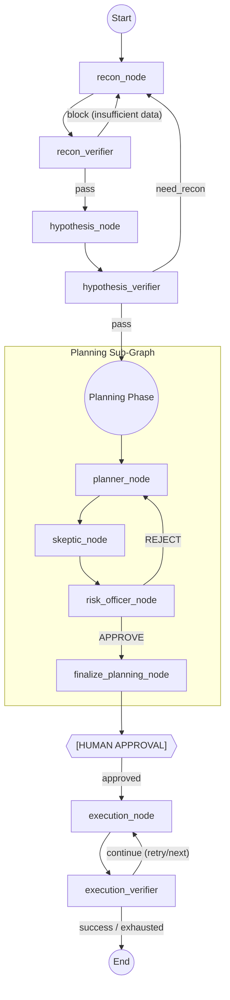

# PentestAgent Documentation

PentestAgent is an autonomous, research-grade penetration testing framework built on **LangGraph**. It replaces naive LLM "guessing" with evidence-grounded reasoning, structured memory, and strict quality verification. Designed for network-based targets, it minimizes context loss, hallucinations, and inefficient token usage through a rigorous Multi-Agent Debate and Verification architecture.

---

## 1. Core Architecture & Topology

The agent is modeled as a state machine (`StateGraph`) using LangGraph. Communication between agents happens entirely through a shared `PentestState` (a TypedDict) rather than ad-hoc messaging. 

### The Execution Graph

The orchestration is split into **action nodes** and **verifier gates**.



1. **`recon_node`**: Executes discovery tools (nmap, curl, etc.) and builds the initial `WorldState`.
2. **`recon_verifier`**: Quality gate. Checks if we have enough high-confidence service data and blocks if the agent is stuck in a repetition loop.
3. **`hypothesis_node`**: Generates evidence-grounded vulnerability hypotheses based on discovered services and known CVEs.
4. **`hypothesis_verifier`**: Quality gate. Filters out weak hypotheses lacking solid evidence or confidence.
5. **Planning Sub-Graph**: 
   - **`planner_node`**: Uses tools to discover exploits and proposes an exploit plan.
   - **`skeptic_node`**: Critiques the planner's proposal, looking for false CVE matches, missing preconditions, or rabbit holes.
   - **`risk_officer_node`**: Evaluates the debate. Ensures safety, validates token/step budgets, and issues an APPROVE or REJECT verdict.
   - **`finalize_planning_node`**: Executes parallel searches and scoring once the risk officer approves the plan.
6. **`execution_node`**: Executes the selected exploit against the target.
7. **`execution_verifier`**: Quality gate. Checks execution output for success markers (e.g., shell prompts, flags), catches repetition, and enforces step limits.

---

## 2. The 3-Tier Memory System

To solve the "context loss" problem common in LLM agents, PentestAgent uses a structured memory system instead of relying solely on linear chat history.

* **WorldState** (`src/memory/world_state.py`): A structured graph of `Host → Service → Version`. Every claim has a **confidence score** (0.0 - 1.0) and an **evidence chain** (raw tool outputs). The verifiers use this to ensure we don't proceed on guesses.
* **Episodic Memory** (`src/memory/episodic.py`): An append-only log of every action, tool call, and outcome. Provides **O(1) repetition detection**, tracks token usage, and generates a compact `to_context_summary()` for LLM prompt injection (preventing context window bloat).
* **Decision Memory** (`src/memory/decision.py`): Records *why* a decision was made. Ensures that the Skeptic and Risk Officer can evaluate the reasoning logic over time.

---

## 3. Evidence-Grounded Hypothesis Generation

Instead of letting the LLM guess which CVEs might apply, the **Hypothesis Agent** (`src/agents/hypothesis.py`) builds explicit evidence chains:

1. **Service Fingerprint**: Identifies running services and their confidence scores.
2. **CVE Search**: Queries `cvemap`/`vulnx` for candidates.
3. **Applicability Check**: Programmatically verifies if the target version falls within the CVE's affected range.
4. **Prerequisite Extraction**: Uses a small LLM call to extract specific prerequisites from the CVE description.
5. **Confidence Scoring**: Computes a composite score based on version match, available exploit code, and met prerequisites.

---

## 4. Setup and Installation

### Prerequisites
* Python 3.10+
* `nmap`, `curl`, `searchsploit` installed on the host system.
* ProjectDiscovery `cvemap` and `vulnx` (for CVE searching).

### Installation
```bash
# 1. Clone the repository
git clone <repo_url> pentest-agent
cd pentest-agent

# 2. Install dependencies (using Poetry or pip)
pip install -r requirements.txt
# OR
poetry install

# 3. Configure Environment Variables
cp .env.example .env
```
Edit `.env` and add your API keys:
```env
OPENAI_API_KEY=sk-...
DEEPSEEK_API_KEY=sk-...
# etc.
```

---

## 5. Configuration

All settings are managed centrally in `configs/config.yaml` and loaded via the `AppConfig` singleton in `src/config.py`.

```yaml
models:
  openai:
    provider: openai
    model: gpt-4o-mini
    api_key: ${OPENAI_API_KEY}
  ollama:
    provider: ollama
    model: qwen3:14b
    base_url: "http://localhost:11434"

planning:
  economic_mode: true # Uses direct-score queries to save tokens during analysis
  model: openai       # The model used for Planner, Skeptic, and Risk Officer
```
You can switch models for different phases in the `runtime` section. The framework supports `openai`, `deepseek`, `gemini`, `ollama`, and `vllm`.

---

## 6. Usage & CLI

The entry point is `main.py`.

**Full Automated Run (Recon → Planning → Execution):**
*Note: The agent will pause and ask for human approval before executing any exploits.*
```bash
python main.py run --target 10.0.0.1 --attacker 10.0.0.2
```

**Resume a Previous Run:**
LangGraph's checkpointing saves the state to disk. If a run crashes or you exit, you can resume exactly where it left off using the thread ID printed at the start of the run.
```bash
python main.py run --target 10.0.0.1 --thread-id 550e8400-e29b-41d4-a716-446655440000
```

**Run Individual Phases:**
Useful for debugging or if you only need a specific capability.
```bash
# Recon only
python main.py recon --target 10.0.0.1

# Planning only (specify app/version)
python main.py plan --app apache --version 2.4.49

# Execution only (provide an existing exploit directory)
python main.py execute --target 10.0.0.1 --doc-dir ./data/exp_source/cve-2021-41773
```

---

## 7. Security & Tool Allowlisting

To prevent catastrophic LLM hallucination (e.g., the agent running `rm -rf /`), shell execution is strictly gated in `src/tools/shell.py`.

* **No raw `shell=True` on unvalidated strings.**
* Commands are parsed with `shlex.split`.
* **Injection check**: Regex patterns block obvious injections (`; rm`, `> /dev/`).
* **Allowlist**: 
    * `recon` mode allows: `nmap`, `curl`, `dig`, `python3`, `grep`, `cat`, etc.
    * `execution` mode adds: `msfvenom`, `sqlmap`, `hydra`, `wpscan`, etc.
    * **Blocked permanently**: `rm`, `shutdown`, `chmod`, `iptables`, etc.
